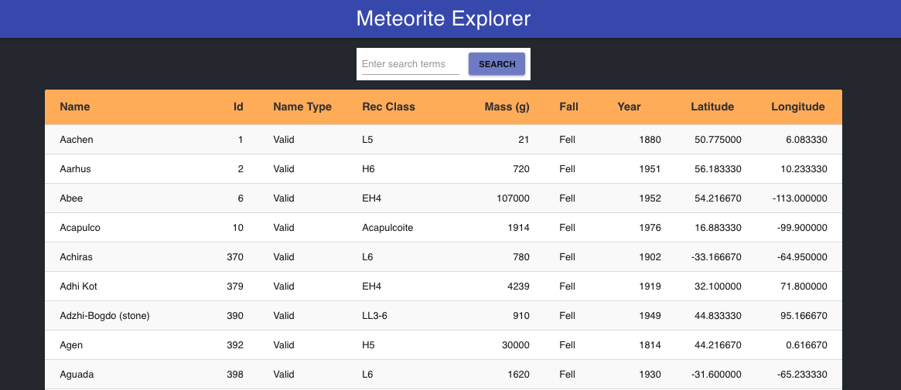

# Chingu Solo Project - Tier 3 - Meteorite Explorer

## Overview
In this project you'll use the 
[Meteorite Landing dataset](https://data.nasa.gov/Space-Science/Meteorite-Landings/gh4g-9sfh)
found on on [NASA's Open Data Portal](https://nasa.github.io/data-nasa-gov-frontpage/) 
to create an application that allows users to explore meteorite strikes across 
the globe.

The application you create will have both a frontend and backend, use
an API provided by the Open Data Portal to access meteorite data, filter
results based on user-specified search criteria, handle large result sets
efficiently, and must handle edge cases such as non-existant search terms. 

## About Chingu

If you aren’t yet a member of Chingu we invite you to join us. We help our 
members transform what they’ve learned in courses & tutorials into the 
practical experience employers need and want.

Our remote team projects let you refine your technical skills and put them 
into practice while gaining new “soft” skills like communication, 
collaboration, and Agile project management. The types of skills that 
help real-world teams get things done!

You can learn more and join us at [chingu.io](https://chingu.io).

## Instructions

For this project you may use any language or framework.

General instructions for all Solo Projects can also be found in the [Chingu
Library](https://voyage.docs.chingu.io/prework/howwork).

### Requirements

**Structure**
- [ ] Review the NASA Open Data Portal 
[documentation](https://nasa.github.io/data-nasa-gov-frontpage/) for the 
Meteorite Landing dataset. Look for:
  - API endpoint
  - Understand the available data fields and their formats
  - How to retrieve the dataset from the NASA Open Data Portal
- [ ] Setup the top-level parent component for the application containing
  - Search panel
  - Search results display area (tabular format)
- [ ] Create the search panel containing:
  - Input text field for entry of search terms
  - Search button
- [ ] Create a search results panel containing results in tabular format as a 
collection of individual components containing the attributes of Meteorites 
meeting the search criteria.
- [ ] Create a Meteorite component that is a stateless description of a single 
meteorite strike. Iterate over the meteorite landing dataset, and create the 
collection of Meteorite components for the entries matching the search criteria 
specified by the user.

**Style**
- [ ] You may implement any style you choose. However, it should be consistent 
(e.g. font, font size, color scheme, layout, etc.).
  - See [Consistent Web Design](https://1stwebdesigner.com/consistent-web-design/)
  - See [Why is consistency important in Web Design?](https://laceytechsolutions.co.uk/blog/importance-of-consistency-in-web-design/)

**Functionality**
- [ ] Meteorite landings are displayed in alphabetical order on the Name column.
- [ ] Users may scroll through the list of landings, or use the search box to 
search for a names that include the entered search term.
- [ ] Searches are case independent. This means the user may type searches in 
lower, upper, or mixed case (like Case, case, or cASe) and the same results 
will be returned.
- [ ] The results list can be reset to its original contents by clearing the 
search box and clicking the 'Search' button

**Other**
- [ ] Your repo needs to have a robust `README.md` (see
[Keys to a Well-Written Readme](https://medium.com/chingu/keys-to-a-well-written-readme-55c53d34fe6d))
- [ ] Make sure that there are no errors in the developer console before 
submitting
- [ ] Make sure you have handled edge cases such as,
  - What happens if the API request takes too long?
  - What if the API returns an error?
  - What if the user submits an empty string?
  - What if the user enters garbage as search criteria?
  - What if the API returns 0 results?
- [ ] Deploy your website  
      Once you're done with the requirements and the console is free of 
      errors, deploy your application. You can use services like 
      Netlify or Heroku. It's up to you! 
- [ ] Make your design fully responsive (see 
[Responsive Web Design Basics](https://developers.google.com/web/fundamentals/design-and-ux/responsive))

**Extras (Not Required)**
- [ ] When the user begins typing search terms display a dropdown with the 
last 10 search terms. This should be updated to match what the user enters
as she types.
- [ ] Use Accessibility techniques (see 
[The A11Y Project](https://a11yproject.com/)) to improve your site for users 
with impairments 
